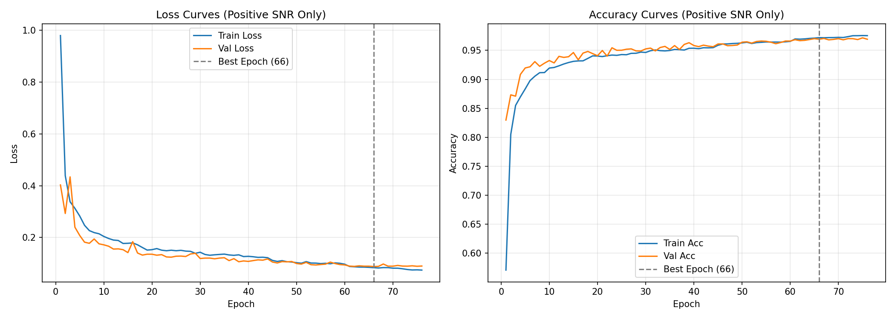
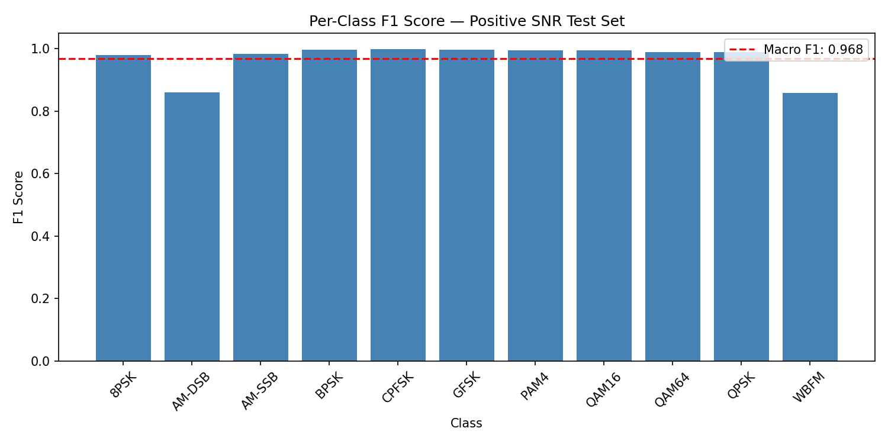
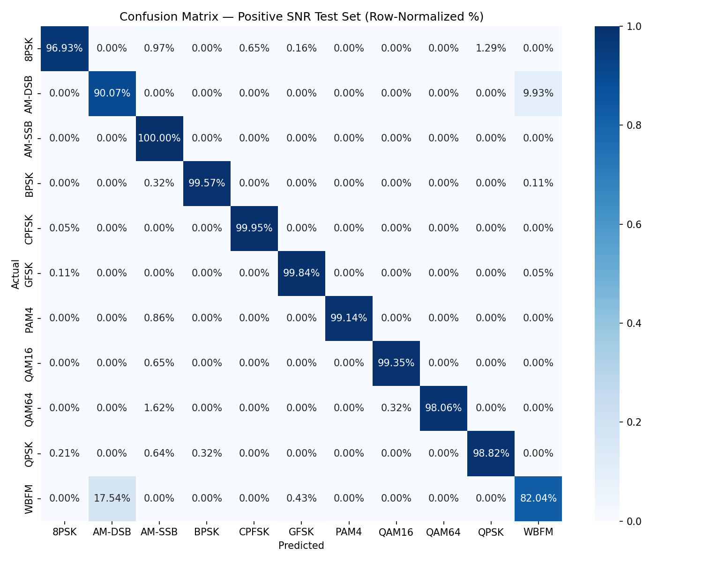

# Modulation Classification on RadioML2016.10a — Positive SNR Regime

A CNN-RNN hybrid model for automatic modulation classification (AMC) on the RadioML2016.10a dataset, evaluated on the positive SNR subset (0 dB to +18 dB).

## Overview

This project implements a dual-branch CNN + LSTM architecture in PyTorch to classify 11 modulation schemes from raw in-phase/quadrature (I/Q) radio signal samples. This report covers the **positive-SNR-only** training regime, which isolates the model's performance ceiling in favorable signal conditions.

**Headline result: 96.92% test accuracy, 0.9679 macro F1** on held-out positive-SNR test data.

## Dataset

- **Source:** [RadioML2016.10a](https://www.deepsig.ai/datasets) (O'Shea & Corgan, 2016)
- **Modulations (11 classes):** 8PSK, AM-DSB, AM-SSB, BPSK, CPFSK, GFSK, PAM4, QAM16, QAM64, QPSK, WBFM
- **Input shape:** `(2, 128)` — 2 I/Q channels, 128 samples per example
- **SNR range used:** 0 dB to +18 dB (2 dB steps), a subset of the dataset's full −20 dB to +18 dB range
- **Subset size:** 81,030 samples (positive SNR only, out of 162,060 total)

### Split

| Split | Samples | Proportion |
|---|---|---|
| Train | ~56,721 | 70% |
| Validation | ~12,155 | 15% |
| Test | 12,155 | 15% |

Stratified splitting was used to preserve class proportions across all three sets. Normalization statistics (mean, std) were computed from the training set only and applied identically to validation and test sets to avoid data leakage.

## Model Architecture

A dual-branch CNN feeding into an LSTM, with a parallel dense path merged before final classification.

```
Input (batch, 2, 128)
  │
  ├── Branch 1: Conv1d(2→64,k=3) → ReLU → Conv1d(64→64,k=3) → ReLU → MaxPool(2) → Dropout(0.4)
  └── Branch 2: Conv1d(2→64,k=3) → ReLU → Conv1d(64→64,k=3) → ReLU → MaxPool(2) → Dropout(0.4)
  │
  Concatenate branches → (batch, 128, 62)
  │
  ├── Dense path: Flatten → Linear(7936→256) → ReLU → Dropout(0.4)
  └── Sequence path: permute → LSTM(input=128, hidden=128) → take last timestep
  │
  Concatenate dense + LSTM outputs → (batch, 384)
  │
  Classifier: Linear(384→128) → ReLU → Dropout(0.5) → Linear(128→11)
```

**Parameters:** 2,240,267 total (all trainable), ~8.55 MB (float32)

Dropout was applied after both CNN branches and after the large dense merge layer (which holds ~90% of total model parameters) to control overfitting.

## Training Setup

| Hyperparameter | Value |
|---|---|
| Optimizer | Adam (lr=0.001, weight_decay=1e-4) |
| Loss | CrossEntropyLoss, class-weighted (`balanced`) |
| Batch size | 256 |
| LR schedule | ReduceLROnPlateau (factor=0.5, patience=5) |
| Early stopping | patience=10 epochs on validation loss |
| Max epochs | 100 (stopped early at epoch 76) |

Class weights were computed using scikit-learn's `balanced` heuristic to counteract the ~6x imbalance between the largest (BPSK/CPFSK/GFSK, ~17.5k train samples each) and smallest (QAM64, ~2.9k train samples) classes in the full dataset.

## Results

### Training curves

Model converged smoothly with no meaningful overfitting — validation loss tracked training loss closely throughout, unlike experiments on the full SNR range.

- Best checkpoint: **epoch 66**, validation loss **0.0881**, validation accuracy **96.9%**
- Training reached >95% validation accuracy by epoch ~53 and remained stable through early stopping



### Test set performance

| Metric | Value |
|---|---|
| Test Accuracy | **96.92%** |
| Test Loss | 0.0931 |
| Macro F1 | 0.9679 |
| Weighted F1 | 0.9692 |

### Per-class results

| Class | Precision | Recall | F1-score | Support |
|---|---|---|---|---|
| 8PSK | 0.9917 | 0.9693 | 0.9804 | 619 |
| AM-DSB | 0.8228 | 0.9007 | 0.8600 | 1057 |
| AM-SSB | 0.9688 | 1.0000 | 0.9842 | 1057 |
| BPSK | 0.9984 | 0.9957 | 0.9971 | 1871 |
| CPFSK | 0.9979 | 0.9995 | 0.9987 | 1871 |
| GFSK | 0.9968 | 0.9984 | 0.9976 | 1871 |
| PAM4 | 1.0000 | 0.9914 | 0.9957 | 933 |
| QAM16 | 0.9978 | 0.9935 | 0.9957 | 465 |
| QAM64 | 1.0000 | 0.9806 | 0.9902 | 309 |
| QPSK | 0.9914 | 0.9882 | 0.9898 | 933 |
| WBFM | 0.8988 | 0.8204 | 0.8578 | 1169 |



### Confusion matrix



**Nine of eleven classes achieve F1 > 0.97.** The two exceptions — **AM-DSB (F1 0.86)** and **WBFM (F1 0.86)** — are confused almost exclusively with each other: 9.9% of AM-DSB samples are misclassified as WBFM, and 17.5% of WBFM samples are misclassified as AM-DSB. This is a well-documented ambiguity in RadioML2016.10a: both are analog modulations carrying similar voice-derived source audio, producing overlapping envelope statistics in the I/Q domain despite different underlying modulation physics. This confusion pattern is consistently reported across published work using this dataset and is not indicative of an architectural or training deficiency.

### Accuracy across the positive SNR range

Accuracy is consistently high (96–98.5%) across the entire 0–18 dB range, with minor non-monotonic variation attributable to per-bin sample size rather than a systematic SNR effect.


## Key takeaways

1. **Positive-SNR modulation classification is a largely solved problem for this architecture** — 96.92% accuracy with 9 of 11 classes exceeding 0.97 F1.
2. **The dominant error source is a specific, known modulation ambiguity** (AM-DSB ↔ WBFM), not diffuse misclassification — this is a dataset characteristic, not a model weakness.
3. Results in this report are scoped to positive SNR conditions only. Performance under negative-SNR (noisy) conditions, and cross-generalization between SNR regimes, is treated separately.

## Repository structure

```
.
├── REPORT.md                          # this file
├── notebook.ipynb                     # full training/eval notebook
├── models/
│   └── cnn_rnn_positive_snr_best.pth  # best checkpoint (epoch 66)
└── plots/
    ├── positive_snr_training_curves.png
    ├── positive_snr_confusion_matrix_counts.png
    ├── positive_snr_confusion_matrix_pct.png
    ├── positive_snr_f1_per_class.png
    └── positive_snr_accuracy_vs_snr.png
```

## Environment

- PyTorch (CUDA)
- scikit-learn, NumPy, Matplotlib, Seaborn
- Trained on NVIDIA GPU (Google Colab)

## Citation

Dataset: T. J. O'Shea, J. Corgan, and T. C. Clancy, "Convolutional Radio Modulation Recognition Networks," *Commun. Comput. Inf. Sci.*, vol. 629, pp. 213–226, Sep. 2016.
